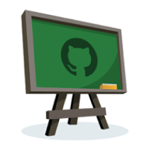

---?color=linear-gradient(180deg, white 75%, black 25%)
@title[Customize Slide Layout]

@snap[west span-75 text-09]
## Teaching Programmming in the Modern Classroom
@snapend

@snap[east span-45]

@snapend

@snap[south span-100]
by Rizal Mohd Norr (PHD CS, MBA, SCJP, LPIC, CBBF, CBSA)
@snapend
---?color=linear-gradient(180deg, white 75%, black 25%)
@snap[midpoint span-100 text-05 text-black]
## Introduction
- What is Git
    - Git (/ɡɪt/) is a distributed version-control system for tracking changes in source code during software development.
    - It is designed for coordinating work among programmers, but it can be used to track changes in any set of files.  
    - Its goals include speed, data integrity, and support for distributed, non-linear workflows.
    
@snapend

@snap[south span-100 text-04]
Git was created by Linus Torvalds in 2005 for development of the Linux kernel, with other kernel developers contributing to its initial development.Its current maintainer since 2005 is Junio Hamano. As with most other distributed version-control systems, and unlike most client–server systems, every Git directory on every computer is a full-fledged repository with complete history and full version-tracking abilities, independent of network access or a central server.Git is free and open-source software distributed under the terms of the GNU General Public License version 2
@snapend

---

### Github

- Why use github
    - Industry standard
    - students get exposure
    - code are managed 
- Why is it an industry standard
    - Over three million users. 
    - Used by Airbnb, netflix etc
    - CI integration

---
### Code Management

- Managing code for instructors and students [Demo]
---
#### Classes
 
- Creating an assignment [Demo]
---
### automation 

- features for auto-grading [Demo]

